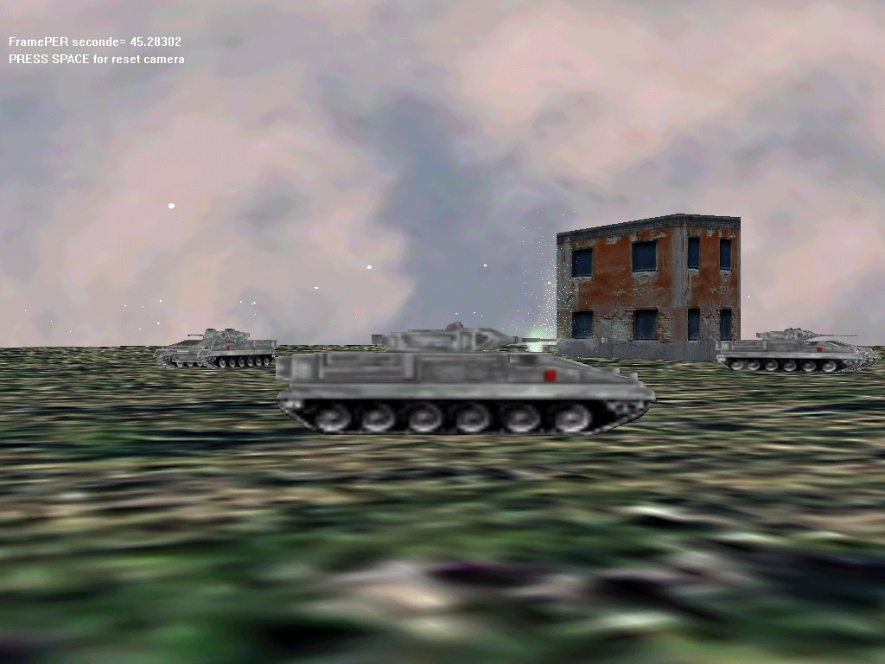

## Johna 3d TankDemo

### Description

This is a 3d tank scene it shows 4 tanks exploring

a land,each tank is controled by a Beta AI engine

The player as in a First person Shooter Game must

avoid tanks or can frelly walk over the land

This demo show how to use the Sound engine of the JohnaDX7 engine...

If you like this demo don't forget to vote for it

to have the Dll missing Write me at Johna.pop@caramail.com

or go to Www.multimania.com/johnapop to have

the missing file.

Please send feedbacks.
 
### More Info
 

             |
---                |---
**Submitted On**   |2001-12-03 23:51:58
**By**             |[polaris](https://github.com/Planet-Source-Code/PSCIndex/blob/master/ByAuthor/polaris.md)
**Level**          |Advanced
**User Rating**    |4.9 (34 globes from 7 users)
**Compatibility**  |VB 5\.0, VB 6\.0
**Category**       |[DirectX](https://github.com/Planet-Source-Code/PSCIndex/blob/master/ByCategory/directx__1-44.md)
**World**          |[Visual Basic](https://github.com/Planet-Source-Code/PSCIndex/blob/master/ByWorld/visual-basic.md)
**Archive File**   |[Johna\_3d\_T392371232001\.zip](https://github.com/Planet-Source-Code/polaris-johna-3d-tankdemo__1-29448/archive/master.zip)

